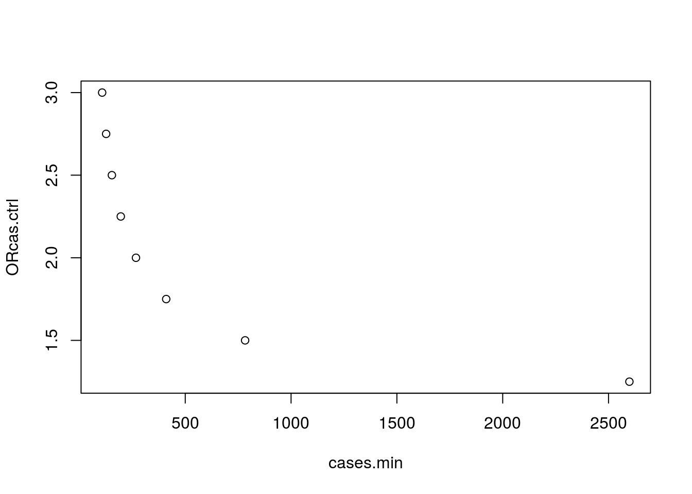

<!-- README.md is generated from README.Rmd. Please edit that file -->
mthapower
=========

Calculate sample size and post-hoc power of association studies involving mitochondrial DNA haplogroups - Based on Samuels et al. AJHG, 2006. 78(4):713-720. [DOI:10.1086/502682](https://www.ncbi.nlm.nih.gov/pmc/PMC1424681)

Installation
------------

-   From CRAN:

``` r
install.packages("mthapower")
```

-   From GitHub:

``` r
# install.packages("devtools")
devtools::install_github("aurora-mareviv/mthapower")
```

Shiny app
---------

-   Run in Shinyapps.io: [mtDNA\_power\_calc](https://aurora.shinyapps.io/mtDNA_power_calc/)
-   Run locally from Gist:

``` r
# install.packages("shiny")
shiny::runGist('5895082')
```

Examples
--------

### Sample size estimation

-   Determine the minimum number of cases (`Ncmin`), required to detect: either a change from `p0` (haplogroup frequency in controls) to `p1` (haplogroup frequency in cases), or a given OR, with a predefined confidence interval, in a study with `Nh` haplogroups.

``` r
library(mthapower)
library(dplyr)
mydata <- mthacases(p0=0.445, Nh=11,
                    OR.cas.ctrl=c(2), power=80,
                    sig.level=0.05) # Baudouin study
mydata <- mthacases(p0=0.445, Nh=11,
                    OR.cas.ctrl=c(1.25,1.5,1.75,2,2.25,2.5,2.75,3),
                    power=80, sig.level=0.05)
mydata <- mydata[c(2,6)]
mydata %>%
  knitr::kable()
```

|  cases.min|  ORcas.ctrl|
|----------:|-----------:|
|   2598.580|        1.25|
|    782.882|        1.50|
|    410.041|        1.75|
|    267.193|        2.00|
|    195.428|        2.25|
|    153.394|        2.50|
|    126.216|        2.75|
|    107.388|        3.00|

``` r
plot(mydata)
```



### Power estimation

-   For a given study size, determine the minimum effect size that can be detected with the desired power and significance level, in a study with `Nh` haplogroups.

``` r
# Example 2a:
# library(mthapower)
pow <- mthapower(n.cases=203, p0=0.443, Nh=13, OR.cas.ctrl=2.33, sig.level=0.05)
pow %>%
  knitr::kable()
```

|   Nh|  ncases|     p0|    p1|  OR.ctrl.cas|  OR.cas.ctrl|   power|  sig.level|
|----:|-------:|------:|-----:|------------:|------------:|-------:|----------:|
|   13|     203|  0.443|  0.65|        0.429|         2.33|  82.759|       0.05|

``` r
# Example 2b:
# Create data frames
pow.H150 <- mthapower(n.cases=seq(50,1000,by=50), p0=0.433, Nh=11,
                      OR.cas.ctrl=1.5, sig.level=0.05)
pow.H175 <- mthapower(n.cases=seq(50,1000,by=50), p0=0.433, Nh=11,
                      OR.cas.ctrl=1.75, sig.level=0.05)
pow.H200 <- mthapower(n.cases=seq(50,1000,by=50), p0=0.433, Nh=11,
                      OR.cas.ctrl=2, sig.level=0.05)
pow.H250 <- mthapower(n.cases=seq(50,1000,by=50), p0=0.433, Nh=11,
                      OR.cas.ctrl=2.5, sig.level=0.05)

# Bind the three data frames:
bindata <- rbind(pow.H150,pow.H175,pow.H200,pow.H250)
# Adds column OR to binded data frame:
bindata$OR <- rep(factor(c(1.50,1.75,2,2.5)),
              times = c(nrow(pow.H150),
                        nrow(pow.H175),
                        nrow(pow.H200),
                        nrow(pow.H250)))
# Create plot:
# install.packages("car")
library(car)
scatterplot(power~ncases | OR, reg.line=FALSE,
            smooth=FALSE, spread=FALSE,
            boxplots=FALSE, span=0.25, by.groups=FALSE,
            data=bindata)
```


